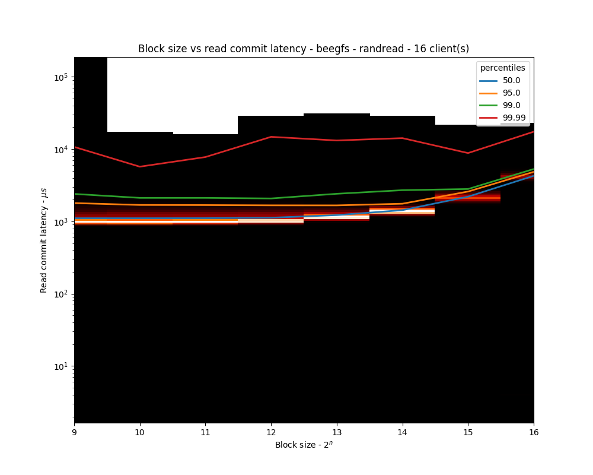
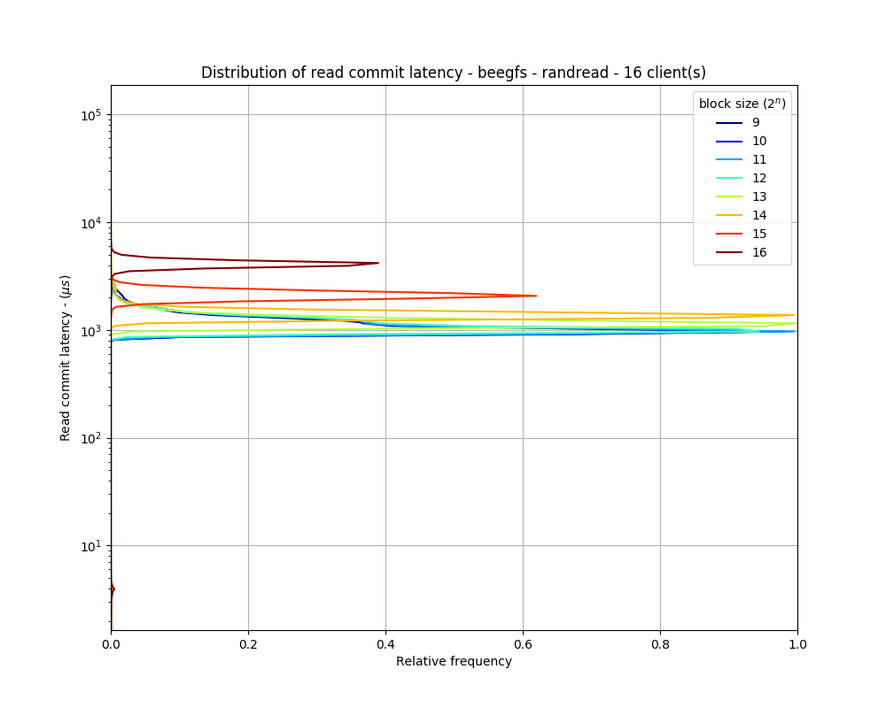

# To install

Installation from local files into a local virtualenv:

    virtualenv venv
    source venv/bin/activate
    pip install .

Installation direct from the git repo:

    pip install git+https://github.com/stackhpc/stackhpc-io-tools

# To build and push docker image

    make docker DOCKER_ID=stackhpc

# To run fio locally (which launches a single client locally)

The `DATA_PATH` and `RESULTS_PATH` here refer to the path to read the
data from and dump results to locally.

    make local SCENARIO=beegfs FIO_RW=randread NUM_CLIENTS=1 \
    DATA_PATH=/path-to-test-dir RESULTS_PATH=/path-to-result-dir

# Alternatively, to deploy multiple clients by creating k8s job

The `DATA_HOSTPATH` and `RESULTS_HOSTPATH` here refer to the path to read the
data from and dump results to on the Kubernetes worker nodes. These paths are
mapped to the default `DATA_PATH` and `RESULTS_PATH` inside containers spawned
by Kubernetes.

    make k8s SCENARIO=beegfs FIO_RW=randread NUM_CLIENTS=16 \
    DATA_HOSTPATH=/path-to-test-host-path RESULTS_HOSTPATH=/path-to-result-host-path \

# To run a batch job:

    for c in 1 2 4 8 16 32; do
      for rw in write randwrite read randread; do
        for s in beegfs ceph; do
          make NUM_CLIENTS=$c FIO_RW=$rw DATA_HOSTPATH=/mnt/$s SCENARIO=$s k8s;
        done
      done
    done

As the test is running, it might be useful to look at the verbose output of the test as follows:

    kubectl --namespace default logs jobs/beegfs-randread-1 --follow

For debugging, you can also invoke shell inside the pod:

    kubectl --namespace default exec -it beegfs-randread-1-n44kj sh

# To generate plot:

    make parse RESULTS_PATH=/path-to-result-dir OUTPUT_PATH=/path-to-output-dir

NOTE: `RESULTS_PATH` is the path for raw data generated by `fio` and
`OUTPUT_PATH` is the parsed data analysed by `bin/fio_parse` executable
presented in this repo.

# Typical output figures:

