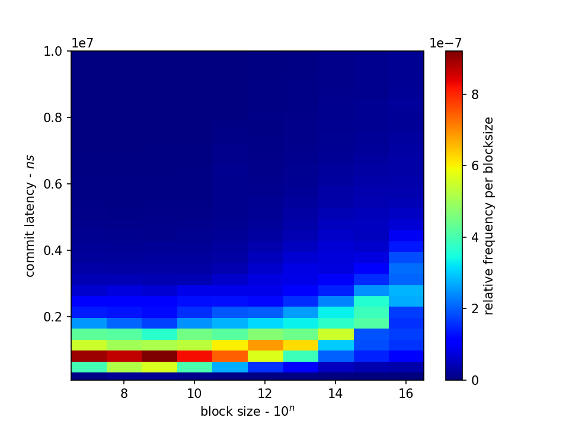

# To install

Installation from local files into a local virtualenv:

    virtualenv venv
    source venv/bin/activate
    pip install .

Installation direct from the git repo:

    pip install git+https://github.com/stackhpc/stackhpc-io-tools

# To run fio locally (which launches a single client locally)

    make local

# To build and push docker image

    make docker

# To deploy k8s job

    make k8s NUM_CLIENTS=16

# To generate plot:

    fio_parse --input-dir input/fio-2018-10-29-12:03:31/read-random --output-dir output/read-random --force

Typical output figure:

